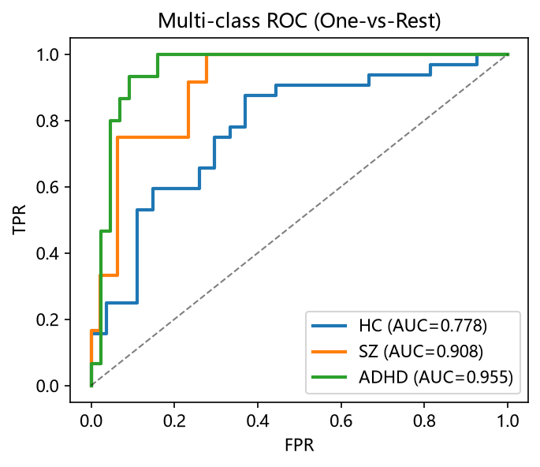
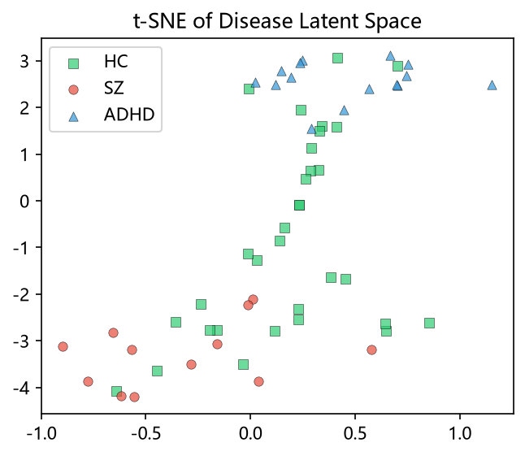

# 2026.8.7_MODEL_ver0.3

**Multimodal Brain Disease Classification v0.3** — HC / Schizophrenia / ADHD 三分类模型，基于 sMRI + fMRI 多模态融合。

> 本 README 只介绍 **v0.2 → v0.3 的新内容**；与 v0.2 相同的架构、模块、数据集与基础用法见 [../2026.7.31_MODEL_ver0.2/README.md](../2026.7.31_MODEL_ver0.2/README.md)。

---

## What's New in v0.3（本次更新的核心）

| 类别 | v0.2 | v0.3 |
|------|------|------|
| **功能编码器** | Linear 投影 → GAT | **TemporalEncoder (1D CNN) → GAT**：时间卷积提取单 ROI 动力学，再做图消息传递 |
| **ROI Embedding** | 投影后添加 | **提前加到原始输入**，更早打破 246 节点趋同 |
| **时间序列长度** | padding 到全局 max T | **线性插值到固定 `--t_target 150`** |
| **ROI 预处理** | trainer 内 z-score | **移入 `collate_fn`**（z-score → 插值一次完成） |
| **校准指标** | 无 | **新增**：ECE、置信度、置信度间隙 |
| **多模态有效性探针** | 无 | **新增**：Logistic 探针 + fusion_gain |
| **潜在空间分析** | 仅打印 Silhouette/DB | **返回结构化指标** + 分离比（cosine 口径） |
| **结果可视化** | 无 | **新增 `test_img/` 7 张图**（见下方 Gallery） |
| **CSV 输出** | 2 个 | **5 个**（+可分性 / +多模态有效性 / +可依赖性） |
| **代码结构** | 7 个模块 | **整合为 5 个**：`models.py` / `trainer.py` / `domain.py` / `losses.py` / `main.py` |

---

## ① 功能分支升级：TemporalEncoder → GAT 双阶段编码

v0.2 把 ROI 时间序列直接做线性投影后送入 GAT；v0.3 在 GAT 之前新增 **TemporalEncoder**（共享权重的 1D CNN），分两步建模：

```
ROI BN (B, 246, 150)
   │
   ▼ 第 1 步：时间动力学（每个脑区"自己的信号长什么样"）
TemporalEncoder — 1D Conv (kernel=7) → ReLU → 1D Conv (kernel=5) → AdaptiveAvgPool1d → (B, 246, 64)
   │   所有 246 个 ROI 共享同一组卷积权重
   ▼ 第 2 步：脑区交互（"脑区之间如何联系"）
GATEncoder — 2 层 GAT + 残差 + LayerNorm → 全局平均池化 → z_functional (B, 64)
```

设计意图：把"单 ROI 时间模式"和"ROI 间图结构"解耦，让每一层只学一件事。

## ② 统一时间插值（`--t_target 150`）

v0.2 对不同长度的 ROI 序列做 **zero-padding** 到全局最大长度；v0.3 改为：

1. 在 `collate_fn` 中按原始长度做 **per-ROI z-score**；
2. 再 **线性插值** 统一重采样到固定长度 `T = 150`。

好处：消除长度差异的同时保留信号形状，且能直接 batch 处理，支持后续 CNN 结构。

## ③ 预测可依赖性评估（新增）

准确率之外，v0.3 开始量化"模型有多自信、自信得对不对"：

| 指标 | 含义 |
|------|------|
| **ECE** (Expected Calibration Error) | 10 bins 校准误差，↓ 好 |
| mean_confidence | 平均 max-softmax 置信度 |
| correct / wrong confidence | 正确 / 错误预测的平均置信度 |
| confidence_gap | 正确置信度 − 错误置信度，↑ 好 |

## ④ 多模态有效性探针（新增）

为了证明"融合确实有用"而不是白加一路模态，v0.3 用 **LogisticRegression + StratifiedKFold(3)** 分别对三个隐空间做分类探针：

```
smri_acc  ← 仅用 z_structure 做探针
fc_acc    ← 仅用 z_functional 做探针
fusion_acc ← 用 z_disease（融合后）做探针
fusion_gain = fusion_acc − max(smri_acc, fc_acc)   ← 融合带来的真实增益
```

`fusion_gain > 0` 即为多模态融合有效性的直接证据。

## ⑤ 潜在空间可分性指标（新增）

统一采用 **余弦距离口径**，每 epoch 记录：

- `latent_silhouette`（cosine 度量，↑ 好）
- `latent_inter_distance`（类中心间 1−cos，↑ 好）
- `latent_intra_distance`（类内样本−中心 1−cos，↓ 好）
- `latent_separation_ratio` = inter / intra（↑ 好）

---

## 结果可视化 Gallery（`test_img/`）

### 训练过程总览


训练全过程的 loss / 精度曲线，可直观看到收敛趋势与早停时机。

### 最佳轮次得分


验证集上最优轮次的综合得分表现。

### 分类性能（各类别指标）


各类别的 **Precision / Recall / F1** 柱状图。可以看出类别间不均衡：ADHD 类 Recall 接近 1.0（几乎全检出），而 SZ 类 Recall 明显偏低（~0.33）——SZ 是当前最难的类别。

### 混淆矩阵


三类的混淆情况，重点看 SZ 与哪一类最容易互相误判。

### ROC 曲线



三类各自的 ROC 曲线：**AUC = HC 0.778 / SZ 0.908 / ADHD 0.955**。ADHD 可分性最好，HC 相对最难区分。

### t-SNE 潜在空间可视化



z_disease 隐空间的 t-SNE 降维投影，观察三类样本的聚类与分离程度。

### 早融合 vs 晚融合对比


结构/功能分支在**不同融合时机**（early vs late）下的性能对比实验。

---

## 新增超参数

| 参数 | 默认值 | 说明 |
|------|--------|------|
| `--t_target` | 150 | **v0.3 新增**：ROI 时间序列插值目标长度 |

其余超参数与 v0.2 一致（见 v0.2 README）。

## 新增输出文件

训练在 `OUTPUT/<timestamp>/` 下新增 3 个 CSV（v0.2 已有 分类性能 + 泛化能力）：

| 文件 | 内容 |
|------|------|
| `潜在空间可分性.csv` | silhouette / 类间距离 / 类内距离 / 分离比 |
| `多模态有效性.csv` | smri_acc / fc_acc / fusion_acc / fusion_gain |
| `预测可依赖性.csv` | ECE / 置信度 / 置信度间隙 |

---

## 快速开始

```bash
python -m 2026.8.7_MODEL_ver0.3.main \
    --t_target 150 \
    --combat_morph --combat_fc \
    --lambda_contrast 0.1 \
    --lambda_ortho 0.05 \
    --lambda_proto 0.5 \
    --lambda_hc_domain 0.1 \
    --seed 42
```

（完整参数说明见 v0.2 README；`--t_target` 为 v0.3 唯一新增参数。）

---

*Version 0.3 — 2026.8.7*
